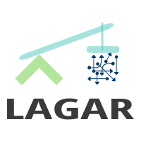

.. LAGAR documentation master file, created by
   sphinx-quickstart on Fri Jul 27 11:13:13 2018.
   You can adapt this file completely to your liking, but it should at least
   contain the root `toctree` directive.

LAGAR: A python package for LAGrangian Analysis and Research 
============================================================

LAGAR is a python package to perform **LAG**\ rangian **A**\nalysis and **R**\ esearch of particle trajectories using analytical and/or real flow fields.
This package was developed at the Non-Linear Physics Group in the University of Santiago the Compostela (USC), Spain by Dr. Angel Daniel Garaboa Paz and Prof. Vicente Pérez Muñuzuri.

This package address the transport problem in a flow velocity field using a dynamical systems approach, 

d **r**\ /dt = **F**\ (**r**\ (t),t)

with initial conditions

**r**\ (t_0)= **r**\_0.

Authoring
---------

.. bibliographic fields (which also require a transform):

:Authors: Dr. Ángel Daniel Garaboa Paz and Prof. Vicente Pérez Muñuzuri
:Organization: University of Santiago de Compostela
:Department: Particle Physics
:Research Group: Grupo de Física No-Lineal (GFNL)
:Address: Campus Vida, 
		  Univ. Santiago de Compostela, 
		  Rúa de José María Suárez Núñez, s/n, 
		  15705 Santiago de Compostela, A Coruña, Spain
:Contact: angeldaniel.garaboa@usc.es
:date:  October-2018
:status: Alpha release
:revision: 0000
:version: 0.1
:copyright: GPLv3

Plattform
---------
:Language: Python 3
:OS: Linux or Windows
:Requirements: Anaconda / pip
:Python packages required: 
- xarray
- numpy
- scipy
- interpolate (conda -c conda-forge interpolate)
- tqdm (fancy progress bars)
- scikit-image (for postprocessing tools)

Documentation
------------------

**Getting Started**

* :doc:`why-LAGAR`
* :doc:`quick-overview`

.. toctree::
   :maxdepth: 1
   :caption: Getting Started

   why-LAGAR
   quick-overview
   installation

User Guide
------------------

* :doc:`installation`
* :doc:`setup-json`

.. toctree::
   :maxdepth: 1
   :caption: user guide

   installation
   setup-json

Code Guide
------------------

* :doc:`code`

.. toctree::
   :maxdepth: 1
   :caption: code guide

   code

Help and Reference
------------------

* :doc:`support`

.. toctree::
   :maxdepth: 1
   :caption: Help & reference

   support

Indices and tables
===========

* :ref:`genindex`
* :ref:`modindex`
* :ref:`search`

