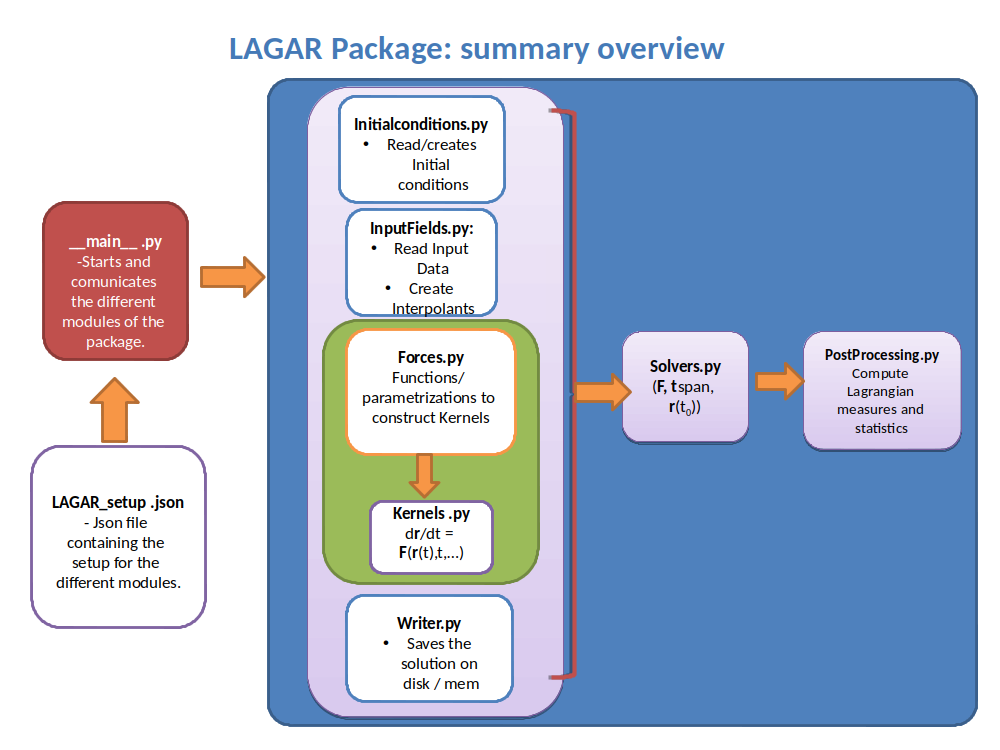

.. highlight:: rst

Quick-overview
==============

LAGAR solves the problem mentioned in the following stages:

0. Read the main configuration file: :file:`LAGAR_setup.json`.

This file constains information about: 

1. Get the initial conditions to be evaluated: From file or fill domain with a regular grid.
2. Get the input files with real data fields: Regular NETcdf data are supported.
3. Get the function **F**: the name of the **F** function inside LAGAR :file:`Kernels.py`.
4. Get the solver type: Euler and RK4.
5. Get the output format setup: vtu, csv, netcdf.
6. Stablish other optional particle parameters

	- Boundaries: Wall, drop, rebound, periodic.
	- Emissors (new initial conditions)

7. Solves the problem.
8. PostProcessing package to analyze the data.

	- Concentrations.
	- Residence Time.
	- FTLE.

Flow-Diagram
------------
The scheme of the package is as follows:

In order to config and initialize the simulations, there a main file:

:file:`LAGAR_setup.json` - `LAGAR Setup`_: Json file with dictionaries containing the setup that will be passed to LAGARCore.

Other important files inside the package are:

1. :file:`InputFields.py` - :func:`LAGAR.InputFields`: It contains different routines, to read input files provided, read the data fields and create the interpolants to evalute the **F** function inside :file:`Kernels.py`. At the moment, it can read NETCDF data format using xarray package.To create the interpolants, it uses two packages: scipy.RegularGridInterpolator or interpolate (conda -c conda-forge interpolate). The first one, allows to use structured but non-regular spaced meshes the second one is a numba-based interpolant and it just allow to use structured and regular-spaced meshes.
2. :file:`Kernels.py`- :func:`LAGAR.Kernels`:  It contains different **F** functions. This kernels must be fed with all the information provided from the preprocessing stage, together with other parameters to feed the **F** function. In future releases, It will contain new **F** functions to solve the motion of new particles.
3. :file:`Solvers.py`- :func:`LAGAR.Solvers`: It contains the ODE solvers: Euler and RK4. More solvers, will be added in upcoming releases.
4. :file:`PostProcessing.py` . :func:`LAGAR.PostProcessing` : It contains functions to compute different Lagrangian measures and statistics from the trajectories obtained.

Additional files.

:file:`IdealFlows.py` -:func:`LAGAR.IdealFlows`: It contains some analytical flows.
 